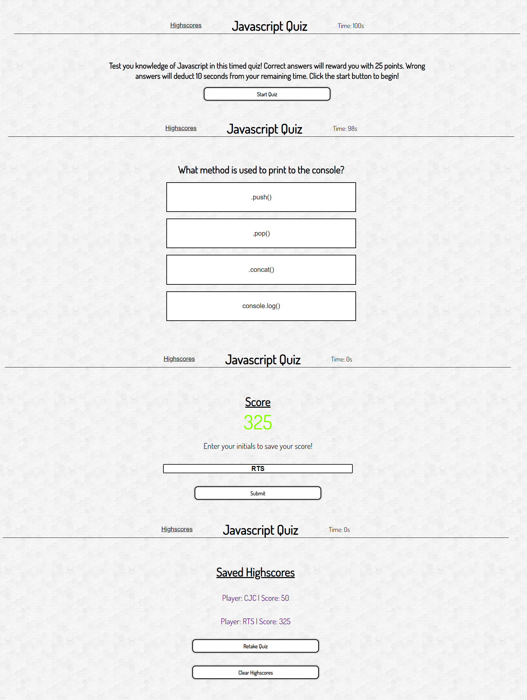

# Javascript-Code-Quiz

## Description
A timed code quiz asking questions about Javascript. Answer the questions wrong, lose time. When the quiz is finished enter your initials to save your high-score. This challenge has helped me learn the use of HTML DOM API. This includes DOM traversing, event listeners, timers intervals, and localStorage capabilities.

## User Story
- AS A coding boot camp student
- I WANT to take a timed quiz on JavaScript fundamentals that stores high scores
- SO THAT I can gauge my progress compared to my peers

## Acceptance Criteria
- GIVEN I am taking a code quiz
- WHEN I click the start button
- THEN a timer starts and I am presented with a question
- WHEN I answer a question
- THEN I am presented with another question
- WHEN I answer a question incorrectly
- THEN time is subtracted from the clock
- WHEN all questions are answered or the timer reaches 0
- THEN the game is over
- WHEN the game is over
- THEN I can save my initials and score

## Screenshots

### Wireframe

### Finished website
